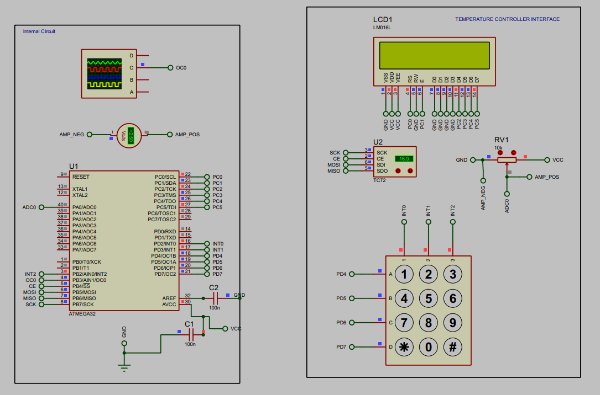
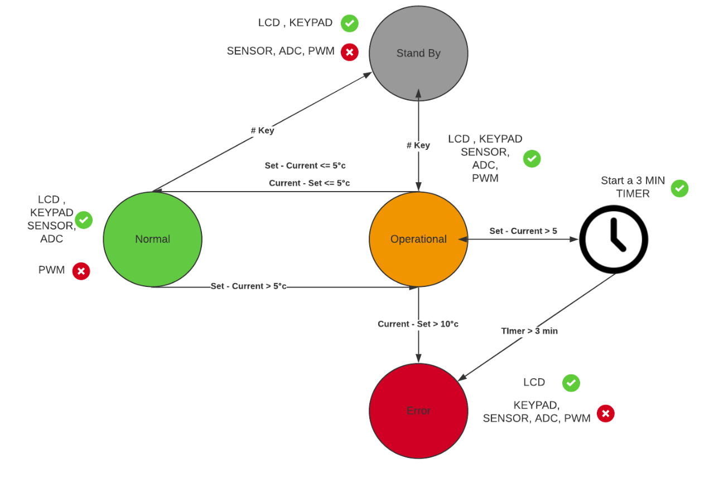

# Embedded-Temperature-Controlling-System
* This system is designed to provide a temperature controlled functionality with some timing constraints. 
* The system provides the ability to reach a targeted temperature requested by a user interface. 
* It provides information for the user about the system state, the current temperature and the selected set temperature.
* It enables the user to calibrate the heater output through a potentiometer interfaced with ADC.
## Applied Concepts:
* ### layered architecture.
  1. **MCAL**
  2. **HAL**
  3. **Service**
  4. **Application** 
* ### Desgin Patterns:
  * Proxy pattern: all the micro-controller abstraction layer **(MCAL)** is implemented with proxy pattern that encapsulates and abstarcts the hardware.
  * Periodic Polling: the core Schedular of the main application is implemented with periodic polling pattern
  * State Machine: system states are treated as state machine.   
* ### Real-time Design Constraints: Some components required periodicity and maximum jitter such as:
  *  Temperature sensor update: every 200ms.
  *  The calibrator update: every 500ms.
  *  LCD Animation steps: every 100ms.
  *  Heating checker: checks if the system doesn't reach the targetted temperature for 3 consecutive minutes.
  *  Jitter is assumed 10% of periodicity of each component.

# System Components

## System is consisted of the following:
1. Atmega32 Microcontroller.
2. LM016 character LCD.
3. TC72 SPI to temperature convertor. 
4. 4X3 Keypad.
5. PWM to voltage convertor module.
6. Calibration resistor.

# System States Flow

